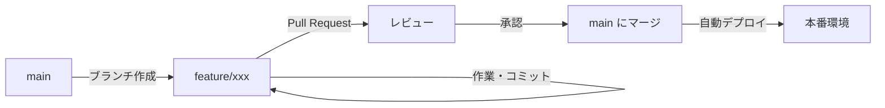

# Git/GitHub 運用ガイド

## 🌊 GitHub Flow

このプロジェクトでは **GitHub Flow** を採用しています。シンプルで理解しやすく、継続的なデプロイに適したワークフローです。

### 基本原則
1. **main ブランチは常にデプロイ可能**: main ブランチのコードは常に本番環境にデプロイできる状態を保つ
2. **フィーチャーブランチで作業**: 新機能や修正は必ず別ブランチで作業
3. **Pull Request でレビュー**: コードの統合前に必ずレビューを実施
4. **マージ後は即デプロイ**: main へのマージ後は自動的にデプロイ

### ワークフローの流れ



## 🏷️ ブランチ命名規則

### ブランチ名の構成
```
<prefix>/<issue番号>-<簡潔な説明>
```

### Prefix 一覧

| Prefix | 用途 | 例 |
|--------|------|-----|
| `feature/` | 新機能の追加 | `feature/42-user-authentication` |
| `fix/` | バグ修正 | `fix/13-login-error` |
| `hotfix/` | 緊急のバグ修正 | `hotfix/99-critical-security-issue` |
| `refactor/` | リファクタリング | `refactor/27-optimize-api-calls` |
| `docs/` | ドキュメントの更新 | `docs/8-update-readme` |
| `test/` | テストの追加・修正 | `test/15-add-unit-tests` |
| `chore/` | ビルド・ツール・依存関係の更新 | `chore/33-update-dependencies` |
| `style/` | コードスタイルの修正（機能に影響なし） | `style/5-format-code` |
| `perf/` | パフォーマンス改善 | `perf/21-optimize-rendering` |

### ブランチ名の例
```bash
# 良い例 ✅
feature/123-add-payment-system
fix/456-navbar-responsive-issue
docs/789-api-documentation
refactor/234-simplify-auth-logic

# 悪い例 ❌
feature-payment  # prefix のスラッシュがない
fix_bug         # アンダースコア使用
new-feature     # prefix がない
Feature/123-xx  # prefix が大文字
```

## 📝 コミットメッセージ規約

### 基本フォーマット
```
<type>: <subject>

[optional body]

[optional footer]
```

### Type 一覧

| Type | 説明 | 絵文字（オプション） |
|------|------|---------------------|
| `feat` | 新機能 | ✨ |
| `fix` | バグ修正 | 🐛 |
| `docs` | ドキュメント | 📝 |
| `style` | フォーマット修正 | 💄 |
| `refactor` | リファクタリング | ♻️ |
| `perf` | パフォーマンス改善 | ⚡ |
| `test` | テスト | 🧪 |
| `chore` | その他の変更 | 🔧 |
| `build` | ビルドシステム | 📦 |
| `ci` | CI/CD | 👷 |
| `revert` | コミットの取り消し | ⏪ |

### コミットメッセージの例
```bash
# 良い例 ✅
feat: ユーザー認証機能を追加
fix: ログイン時のエラーハンドリングを修正
docs: API ドキュメントを更新
refactor: 認証ロジックを簡素化
perf: 画像の遅延読み込みを実装

# 絵文字付きの例（プロジェクトで統一する場合）
✨ feat: 決済システムを実装
🐛 fix: カート内の商品数計算を修正
📝 docs: インストール手順を追加

# 悪い例 ❌
更新        # type がない、説明が不明確
fix bug    # type の形式が違う
追加しました  # 何を追加したか不明
```

## 🔄 Pull Request のベストプラクティス

### PR タイトル
```
[<Type>] <簡潔な説明> (#<Issue番号>)
```

例：
- `[Feature] ユーザー認証機能の実装 (#123)`
- `[Fix] ログインエラーの修正 (#456)`
- `[Docs] README の更新 (#789)`

### PR テンプレート
```markdown
## 📋 概要
このPRで実装/修正した内容の概要を記載

## 🔗 関連Issue
Closes #<Issue番号>

## 📝 変更内容
- [ ] 変更点1
- [ ] 変更点2
- [ ] 変更点3

## 🧪 テスト方法
1. 手順1
2. 手順2
3. 期待される結果

## 📸 スクリーンショット（UI変更の場合）
| Before | After |
|--------|-------|
| 画像 | 画像 |

## ✅ チェックリスト
- [ ] コードが正しく動作する
- [ ] テストを追加/更新した
- [ ] ドキュメントを更新した
- [ ] TypeScript/ESLint エラーがない
- [ ] ビルドが成功する
```

## 🚀 実践的なワークフロー

### 1. 新機能の開発
```bash
# 最新の main を取得
git checkout main
git pull origin main

# フィーチャーブランチを作成
git checkout -b feature/123-user-profile

# 作業してコミット
git add .
git commit -m "feat: ユーザープロフィール画面を追加"

# リモートにプッシュ
git push -u origin feature/123-user-profile

# GitHub で Pull Request を作成
```

### 2. バグ修正
```bash
# main から修正ブランチを作成
git checkout main
git pull origin main
git checkout -b fix/456-login-error

# 修正してコミット
git add .
git commit -m "fix: ログイン時のnullチェックを追加"

# プッシュして PR 作成
git push -u origin fix/456-login-error
```

### 3. 緊急修正（Hotfix）
```bash
# main から直接ブランチを作成
git checkout main
git pull origin main
git checkout -b hotfix/999-critical-bug

# 修正・テスト・コミット
git add .
git commit -m "hotfix: セキュリティ脆弱性を修正"

# 緊急でプッシュ
git push -u origin hotfix/999-critical-bug

# 優先的にレビューとマージ
```

## 🔍 コードレビューのポイント

### レビュアーが確認すること
- [ ] **機能性**: 要件を満たしているか
- [ ] **コード品質**: 読みやすく保守しやすいか
- [ ] **パフォーマンス**: 効率的な実装か
- [ ] **セキュリティ**: 脆弱性はないか
- [ ] **テスト**: 適切にテストされているか
- [ ] **ドキュメント**: 必要な説明があるか

### レビューコメントの書き方
```markdown
# 提案 💡
```suggestion
const userName = user?.name || 'ゲスト';
```
null チェックを追加することをお勧めします。

# 質問 ❓
この処理が必要な理由を教えていただけますか？

# 必須修正 🚨
セキュリティ上の問題があるため、必ず修正してください。

# 称賛 👍
素晴らしい実装ですね！とても読みやすいです。
```

## 🎯 マージ戦略

### Squash and Merge（推奨）
- 複数のコミットを1つにまとめてマージ
- コミット履歴をクリーンに保つ
- PR 単位で履歴を管理

```bash
# GitHub UI で "Squash and merge" を選択
# または
git merge --squash feature/123-new-feature
```

### その他のマージ方法
- **Create a merge commit**: マージコミットを作成（履歴を保持）
- **Rebase and merge**: リベースしてマージ（直線的な履歴）

## ⚠️ 注意事項

### やってはいけないこと
- ❌ main ブランチへの直接プッシュ
- ❌ レビューなしのマージ
- ❌ ビルドが失敗している状態でのマージ
- ❌ コンフリクトを解決せずにマージ
- ❌ 大きすぎる PR（500行以上は分割を検討）

### 推奨事項
- ✅ 小さく頻繁なコミット
- ✅ わかりやすいコミットメッセージ
- ✅ PR は小さく保つ（レビューしやすい）
- ✅ CI/CD のチェックをパスしてからマージ
- ✅ 定期的に main から最新を取り込む

## 🔧 便利な Git エイリアス

`.gitconfig` に追加すると便利なエイリアス：

```ini
[alias]
    # ログを見やすく表示
    lg = log --graph --pretty=format:'%Cred%h%Creset -%C(yellow)%d%Creset %s %Cgreen(%cr) %C(bold blue)<%an>%Creset' --abbrev-commit
    
    # ブランチ一覧を最終更新順で表示
    br = branch --sort=-committerdate
    
    # 現在のブランチ名を表示
    current = rev-parse --abbrev-ref HEAD
    
    # ステータスを短縮表示
    st = status -s
    
    # 最新のコミットを修正
    amend = commit --amend --no-edit
    
    # 作業内容を一時保存
    save = stash save
    
    # 一時保存を復元
    pop = stash pop
```
