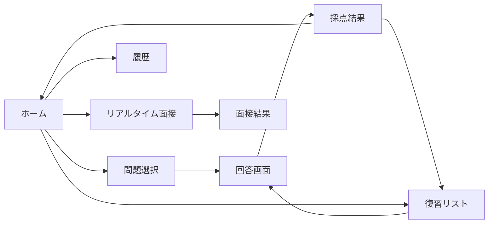

# Interview Forge - v0 UI仕様書

## 概要
技術面接練習Webアプリケーション。LLMを活用して問題生成・採点・フィードバックを行う。

## 技術スタック
- **Framework**: Next.js 15 (App Router)
- **UI Library**: React 19
- **Styling**: Tailwind CSS
- **Component Library**: shadcn/ui
- **Icons**: Lucide React
- **Form**: React Hook Form + Zod
- **State**: Zustand or TanStack Query
- **Markdown**: @uiw/react-md-editor

## カラーテーマ
- モダンでプロフェッショナルな配色
- ダークモード対応
- アクセントカラー: Blue/Indigo系

## 画面構成

### 1. ホーム画面 (/)
**目的**: アプリの入口。練習開始と履歴確認への導線

**レイアウト**:
- ヘッダー: ロゴ「Interview Forge」+ ナビゲーション
- ヒーローセクション:
  - キャッチコピー「技術面接の準備を、AIでスマートに」
  - 「練習を始める」ボタン（Primary）
  - 「履歴を見る」ボタン（Secondary）
- 統計カード（グリッド3列）:
  - 総回答数
  - 平均スコア
  - 連続練習日数
- 最近の練習セクション（カードリスト）

### 2. 問題選択画面 (/practice)
**目的**: カテゴリと難易度を選んで練習開始

**コンポーネント**:
- カテゴリ選択カード（グリッド）:
  - Web基礎
  - HTTP/REST API
  - React/Frontend
  - Backend/Database
  - System Design
  - DevOps/SRE
- 難易度選択（ラジオボタングループ）:
  - Easy / Medium / Hard
- 「ランダム出題」トグル
- 「練習開始」ボタン

### 3. 回答画面 (/practice/answer)
**目的**: 問題表示と回答入力

**レイアウト**（2カラム）:
- 左側: 問題表示エリア
  - カテゴリ/難易度バッジ
  - 問題文（Markdown表示）
  - タイマー（オプション）
- 右側: 回答入力エリア
  - Markdownエディタ（プレビュー付き）
  - 文字数カウンター
  - 「提出」ボタン
  - 「下書き保存」ボタン

### 4. 採点結果画面 (/practice/result)
**目的**: AIによる採点結果とフィードバック表示

**コンポーネント**:
- スコアサマリーカード:
  - 総合スコア（大きく表示、5段階評価）
  - レーダーチャート（観点別スコア）
- 詳細評価セクション（アコーディオン）:
  - 正確性
  - 網羅性
  - 論理構成
  - 専門用語の使用
- フィードバックセクション:
  - 良かった点
  - 改善点
  - 推奨学習リソース
- アクションボタン:
  - 「復習リストに追加」
  - 「類似問題に挑戦」
  - 「ホームに戻る」

### 5. 履歴画面 (/history)
**目的**: 過去の練習履歴と進捗確認

**コンポーネント**:
- フィルター/ソート:
  - カテゴリフィルター
  - 日付範囲
  - スコア順/日付順ソート
- 履歴テーブル/カード:
  - 日時
  - カテゴリ/難易度
  - 問題タイトル
  - スコア
  - 「詳細を見る」リンク
- ページネーション

### 6. 復習画面 (/review)
**目的**: 要復習問題の管理と再挑戦

**レイアウト**:
- 復習待ちリスト（カード形式）:
  - 問題情報
  - 前回スコア
  - 「再挑戦」ボタン
  - 「削除」ボタン
- 復習済みリスト（折りたたみ可能）

### 7. リアルタイム面接モード (/interview)
**目的**: 追加質問付きの面接シミュレーション

**コンポーネント**:
- チャット風UI:
  - 面接官の質問（左側）
  - 自分の回答（右側）
- 入力エリア:
  - テキストエリア
  - 送信ボタン
  - タイマー表示
- 終了後: セッションサマリー表示

## UIコンポーネント詳細

### 共通コンポーネント
```typescript
// ヘッダー
<Header>
  - Logo
  - Navigation (Home, Practice, History, Review)
  - User Menu (将来実装)
</Header>

// カード
<Card>
  - variant: default | bordered | elevated
  - 問題カード、統計カード、結果カードで使用
</Card>

// ボタン
<Button>
  - variant: primary | secondary | outline | ghost
  - size: sm | md | lg
</Button>

// バッジ
<Badge>
  - カテゴリ、難易度、スコア表示
  - variant: default | success | warning | error
</Badge>

// プログレスバー
<Progress>
  - スコア表示、進捗表示で使用
</Progress>

// モーダル/ダイアログ
<Dialog>
  - 確認ダイアログ、設定画面で使用
</Dialog>
```

### 特殊コンポーネント
```typescript
// Markdownエディタ
<MarkdownEditor>
  - ライブプレビュー
  - シンタックスハイライト
  - ツールバー（Bold, Italic, Code, Link等）
</MarkdownEditor>

// スコア表示
<ScoreDisplay>
  - 円形プログレス or 星評価
  - アニメーション付き
</ScoreDisplay>

// レーダーチャート
<RadarChart>
  - 観点別スコア可視化
  - Chart.js or Recharts使用
</RadarChart>
```

## 画面遷移フロー


## レスポンシブ対応
- Mobile First設計
- ブレークポイント:
  - sm: 640px
  - md: 768px
  - lg: 1024px
  - xl: 1280px
- タブレット: 2カラムレイアウトを1カラムに
- モバイル: カード幅100%、ナビゲーションはハンバーガーメニュー

## アニメーション/インタラクション
- ページ遷移: フェードイン
- ボタンホバー: スケール拡大
- カード: ホバーでシャドウ強調
- スコア表示: カウントアップアニメーション
- 成功/エラー: トースト通知（右上）

## アクセシビリティ
- キーボードナビゲーション対応
- スクリーンリーダー対応（ARIA labels）
- フォーカス表示明確化
- カラーコントラスト WCAG AA準拠

## パフォーマンス考慮
- 画像最適化（next/image使用）
- コード分割（dynamic import）
- フォント最適化（next/font）
- Loading skeleton表示

## エラー処理UI
- エラー境界（Error Boundary）
- 404ページ
- API エラー時のフォールバック表示
- オフライン対応メッセージ

## 将来の拡張性
- 認証後のユーザーダッシュボード
- ソーシャル機能（ランキング、シェア）
- カスタムテーマ設定
- 多言語対応（i18n）